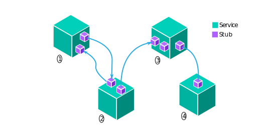

<hr/>

<p align="center">
<a href='https://github.com/koursaros-ai/koursaros/blob/master/LICENSE'>
    
</a>
</p>

<p align="center">
  <a href="#highlights">Highlights</a> •
  <a href="#overview">Overview</a> •
  <a href="#install">Install</a> •
  <a href="#getting-started">Getting Started</a> •
  <a href="#documentation">Documentation</a> •
  <a href="#tutorial">Tutorial</a> •
  <a href="#contributing">Contributing</a>
</p>

Koursaros is a distributed, cloud-native platform for developing and deploying neural search and inference applications.

Koursaros leverages a general-purpose microservice / broker architecture to enable low-latency, scalable deep neural network training and can be directly deployed to kubernetes for production.

## Results

<table>
  <tr>
    <th>Benchmark</th>
    <th>Label Accuracy</th>
    <th>Paper</th>
    <th>Models</th>
  </tr>
  <tr>
    <td><a href="fever.ai">fever.ai</a>
    <td>0.7396 (2nd)</td>
    <td><a href='TODO'>An Automated Fact Checker in Era of Fake News</a></td>
    <td><a href='TODO'>Scorer</a>, <a href='TODO'>Inference</a>, <a href='TODO'>Elastic Search (BM25)</a></td>
  </tr>
</table>

## Highlights

<table>
  <tr>
  <td width="33%">
    <p><h3 align="center">🧪</h3><h3 align="center">SoTA</h3></p>
  </td>
  <td>
    <p>Cutting edge neural models can be swapped in to quickly train and build production deployments.</p>
  </td>
  </tr>
  <tr>
  <td width="33%">
    <p><h3 align="center">🔎</h3><h3 align="center">Transparent</h3></p>
  </td>
  <td>
    <p>The pub-sub architecture enables monitoring and logging of the pipelines via RabbitMQ.</p>
  </td>
  </tr>
  <tr>
  <td width="33%">
    <p><h3 align="center">🎂</h3><h3 align="center">Easy Development</h3></p>
  </td>
  <td>
    <p>Before deploying the pipeline to the cloud, you can easily test the pipeline locally or in a dev environment.</p>
  </td>
  </tr>
  <tr>
  <td width="33%">
    <p><h3 align="center">🔧</h3><h3 align="center">Customizable</h3></p>
  </td>
  <td>
    <p>Koursaros uses markup language to simplify the creation of microservice pipelines.</p>
  </td>
  </tr>
</table>

## Overview

<p align="center">
<a>

</a>
</p>

The fundamental unit of Koursaros is a *stub*. Each *service* has a
set of stubs that designate where messages get sent to and from.
Each service performs a job depending on the stub that receives the message.
After the service finishes the job, it can send the result on to the next stub in the pipeline.
That way, stubs can be combined in different ways to define a *pipeline*.
For example, service 1 and 2 can define a separate pipeline from a pipeline created by
service 2, 3, and 4. Stubs can only send messages within their defined pipeline, but services
can share memory across pipelines. This is useful for holding models in memory and other applications.
Each pipeline is defined in the *stubs.yaml* so that Koursaros can automatically route the messages.

For example, here is a simplified version of our fact-checking pipeline:

<table>
<tr>
<th>stubs.yaml</th>
</tr>
<tr>
<td>
   <pre lang="yaml">
 stubs:
   send: client.sendClaims() -> Claim                                   | retrieval
   retrieval: retriever.getRelatedArticles(Claim) -> ClaimWithArticles  | compare
   compare: model.factcheck(ClaimWithArticles)                        ->|
   </pre>
</td>
</tr>
</table>


Koursaros takes the factchecking pipeline definition and spins up the client, retriever, and model
services on separate processes. Each service has one stub in this case. Koursaros routes the messages
between the service stubs. If a microservice has multiple stubs, each stub gets its own thread.
The type of message being sent is also defined ahead of time.
So for the send stub, the client executes the sendClaims function and returns a
Claim message to the retrieval stub. The claim message gets routed to the retriever,
who takes that Claim and finds related articles with the getRelatedArticles function,
and returns a ClaimWithArticles message.

## Install
### Requirements
You need Python 3.6 or later to run Koursaros.

### Stable Version
#### Installing via pip
We recommend installing Koursaros via pip:
```
pip3 install koursaros
```
Installation will use Python wheels from PyPI, available for OSX, Linux, and Windows.

### Latest Version
### Installing via pip-git
You can install the latest version from Git:
```
pip3 install git+https://git@github.com/koursaros-ai/koursaros.git
```

## Getting Started
### Creating a pipeline
```
kctl pull app my-app --git koursaros --dir examples/simple-app
cd my-app
kctl deploy app
```

Then open [http://localhost:5200/](http://localhost:5200/) to see your pipeline running!

This simple pipeline has three microservices: a sender, preprocesser, and model.
The sender sends a request to factor a number: "Please factor 12!".
The preprocesser receives this request and extracts the number.
The model gets only the number, factors it, and sends it back to the sender.

kctl created a directory called MyPipeline with the following project structure:

```
my-app
├── README.md
├── .gitignore
├── services
│   ├── sender
│   └── model
├── pipelines
│   └── factor-number
│       ├── stubs.yaml
│       └── messages.proto
└── models
```

Now let's create a new microservice called counter.
Counter will just count the number of factors before sending the factors to the sender.

First, we need add the counter to the ```stubs.yaml```.
Let's say the counter will receive the Factors message and will return a FactorsWithCount message.
<table>
<tr>
<th>Before</th>
<th>After</th>
</tr>
<tr>
<td width="30%">
   <sub>
   <pre lang="yaml">
 stubs:
   send: sender.request() -> Request                    | preprocess
   preprocess: preprocesser.parse(Request) -> Number    | compare
   factor: model.factor(Number) -> Factors              | count
   response: sender.getResponse(Factors)              ->|
   </pre>
   </sub>
</td>
<td width="30%">
   <sub>
   <pre lang="yaml">
 stubs:
   send: sender.request() -> Request                    | preprocess
   preprocess: preprocesser.parse(Request) -> Number    | compare
   factor: model.factor(Number) -> Factors              | count
   count: counter.count(Factors) -> FactorsWithCount    | response
   response: sender.getResponse(FactorsWithCount)     ->|
   </pre>
   </sub>
</td>
</tr>
</table>

Now let's generate the service script:
```
kctl create service counter
```
This creates a new service called counter in the services directory.
Let's look at its ```__init__.py```:
<table>
<tr>
<th>Before</th>
<th>After</th>
</tr>
<tr>

<td width="30%">

   <pre lang="python">
from koursaros import Service

service = Service(__name__)


@service.pubber
def send(publish):
    pass


@service.subber
def process(proto, publish):
    pass


@service.main
def main(connection):
    if connection == 'dev_local':
        pass
   </pre>

</td>
<td width="30%">
    
   <pre lang="python">
from koursaros import Service
from ..protos import FactorsWithCount

service = Service(__name__)


@service.subber
def process(factors, publish):
    count = len(factors.numbers)
    factors_with_count = FactorsWithCount(
        factors=factors,
        count=count
    )
    publish(factors_with_count)


@service.main
def main(connection):
    if connection == 'dev_local':
        pass
   </pre>
    

</td>
</tr>
</table>

Then we need add the FactorsWithCount to the ```messages.proto```:

<table>
<tr>
<th>Before</th>
<th>After</th>
</tr>
<tr>

<td width="30%">

   <pre lang="proto">
message Request {
    uint64 id = 1;
    string text = 2;
}

message Number {
    uint64 request_id = 1;
    uint64 number = 2;
}

message Factors {
    uint64 request_id = 1;
    repeated Number numbers = 2;
}
   </pre>

</td>
<td width="30%">
    
   <pre lang="proto">
message Request {
    uint64 id = 1;
    string text = 2;
}

message Number {
    uint64 request_id = 1;
    uint64 number = 2;
}

message Factors {
    uint64 request_id = 1;
    repeated Number numbers = 2;
}

message FactorsWithCount {
    uint64 request_id = 1;
    repeated Number numbers = 2;
    uint64 count = 3;
}
   </pre>
    

</td>
</tr>
</table>

Now start your app again with ```kctl deploy -p MyPipeline``` and see the changes!
    
## Tutorials
- <a href = 'tutorials/fever'>Use Koursaros to get SoTA results in dev environment</a> on the <a href='fever.ai'>fever.ai</a> benchmark using pretrained models.
- Training Elastic Search BM25 algorithm using Ax Bayesian Optimizer
- Training custom models and deploying them as stubs
- Deploying fever.ai pipeline to production (Coming Soon)
